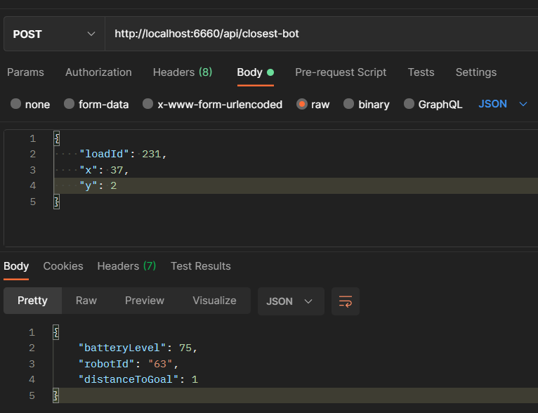
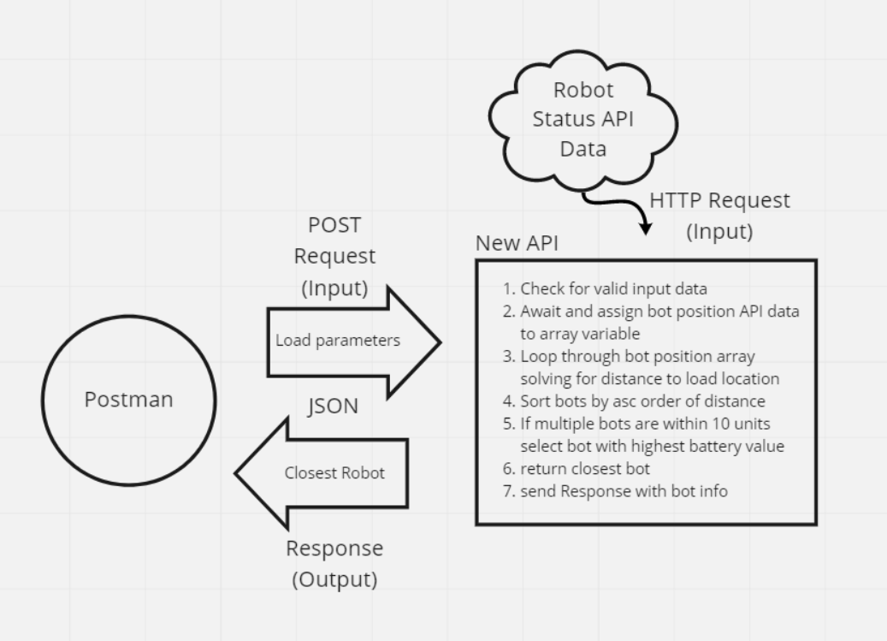

# svt-assessment 
- Build an API that returns the closest robot to a given load via POST method.

# Testing
1. Clone down github repo
2. Install dependencies 
3. Start server by typing "npm run start:watch" into your terminal
4. Open Postman and paste "http://localhost:6660/api/closest-bot" into request url 
5. Switch "GET" verb to "POST"
6. Select buttons as shown in the image below
7. Enter the following JSON with any x, y coordinate and hit send 
  ```
  {
    "loadId": 231,
    "x": 37,
    "y": 2
  }
  ```

### Example Post request(top) and response(bottom)


---

# Next Steps
  - Increase search efficiency
    -Implementation: Slice off array at the index of robots outside of 10 units

  - Add input validation for load coordinates outside of grid boundaries and stationary obstacles 
    -Implementation: Define grid x, y boundaries rejecting any input within no go areas

  - Move more logic out of server.js to more closely align with single responsibility principles
    -Implementation: Write functions for filtering and object key addition/subtraction

  - Learn to build this thing in .NET Core!

# Design

